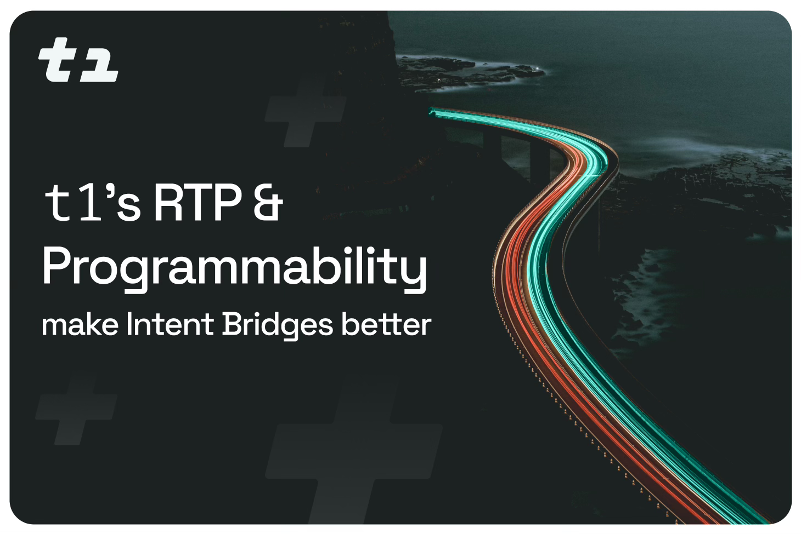

  

<h1 align="center">
  Welcome to  protocol 👋
</h1>

  <strong>RTP & Programmability for Better Intent Bridges</strong>

  <a href="https://t1protocol.com/"> Website</a> •
  <a href="https://docs.t1protocol.com"> Docs</a> •
  <a href="https://twitter.com/t1protocol"> Twitter</a> •

---

## 🚀 About Us

 is pioneering intent-based bridges with **RTP (Real Time Proofs)** and **programmability**, enabling secure, flexible, and developer-friendly interactions between blockchain networks.

We’re focused on transparency, trust, and community-driven open-source development.

---

## 🛠️ Featured Repositories

| Repo | Description | Status |
|------|-------------|--------|
| [t1 monorepo](https://github.com/t1protocol/t1) | Core implementation of t1’s RTP and programmable logic. | 🚧 Testnet |
---

## 🤝 Contribute

We welcome developers, researchers, and contributors!

- 📖 [How to Contribute](https://github.com/t1protocol/t1?tab=readme-ov-file#contributing)
- 🐛 [File Issues](https://github.com/t1protocol/t1/issues)

💬 Want to engage further? Join the discussion on our [Discord](https://discord.gg/C6kDaJS5).

---

  <i> protocol – Making Intent Bridges Better</i>

